**Manual Setup - Customer Order Services and Product Search Service - JavaEE Enterprise Application**

**Setting Up Security**

1.  Log into the Admin Console.

2.  In the Global security section, check **Enable application
    security** and click **Save**.

1.  In the **Users and Groups** section, select **Manage Users** and
    create the following users:

-   username: **rbarcia** password: **bl0wfish**

-   username: **kbrown** password: **bl0wfish**

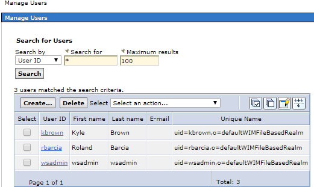

1.  In the **Users and Groups** section, select **Manage Groups** and
    create the following group:

-   group name: **SecureShopper**

This JEE application implements role-based security whereby only those
users and groups with appropriate roles can execute certain actions. As
a result, all users must belong to the SecureShopper group if they want
to be able to access to the protected customer resources:

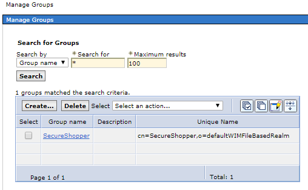

During deployment, you will need to map your desired users or groups to
the **SecureShopper** role. By default, SecureShopper group gets mapped
to the SecureShopper role.

\**Alternatively, you can leverage an external security
registry such as an LDAP server for your users and groups. This is the
path that the reference architecture has taken for this application
which gets described in the different phases
in *[*here*](https://github.com/ibm-cloud-architecture/refarch-jee)*.*

1.  Under **Global Security**, select **J2C authentication data**.
    Create a new user named IN**DB\_USER** using your db2 instance
    and password.

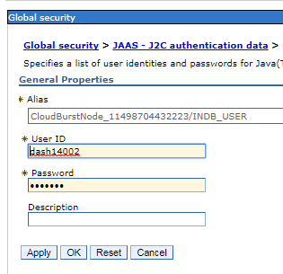

**Configuring JDBC Resources**

1.  Go to the **Resources &gt; JDBC &gt; JDBC Providers** section and
    ensure that you are at the **Cell** scope.

> 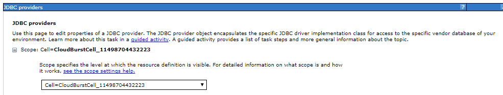

1.  Click the New Button to create a new JDBC provider.

-   Database type : **DB2**

-   Provider type : **DB2 Using IBM JCC Driver**

-   Implementation type : **XA data source**

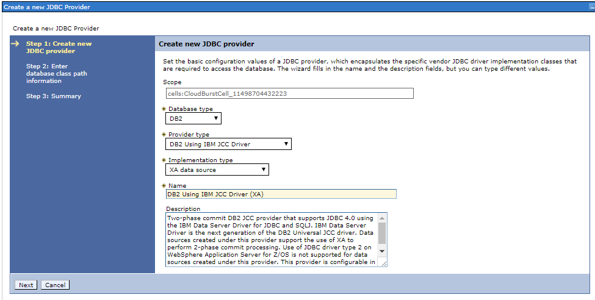

1.  You need to enter the database class path information. Enter the
    directory where the DB2 Java is set.

> Note: Create the directory db2drivers and copy the files db2jcc4.jar
> and db2jcc\_license\_cu.jar into that on the OS system. If DB2
> installed on the same then use /home/db2inst1/sqllib/java path.

1.  Press **Next** and then **Finish**. Save the Configuration.
    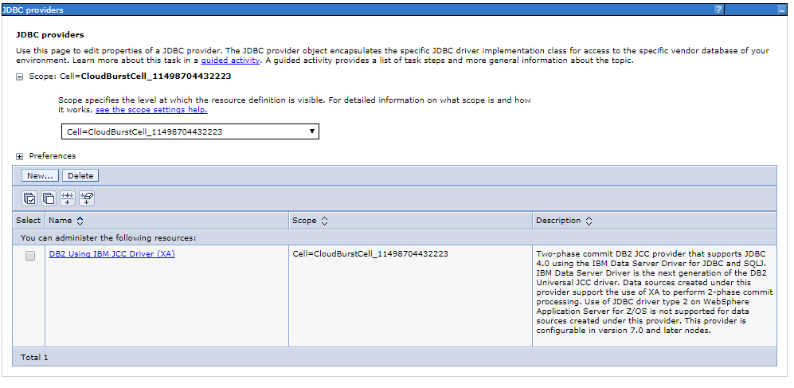

2.  Go to the **Resources &gt; JDBC &gt; Data sources** section to
    create a new data source.

<!-- -->

1.  Make sure that the scope is at **Cell** level and click **New**

2.  OrderDB - Step 1

    -   Data source name: **OrderDS**

    -   JNDI name: **jdbc/orderds**

> 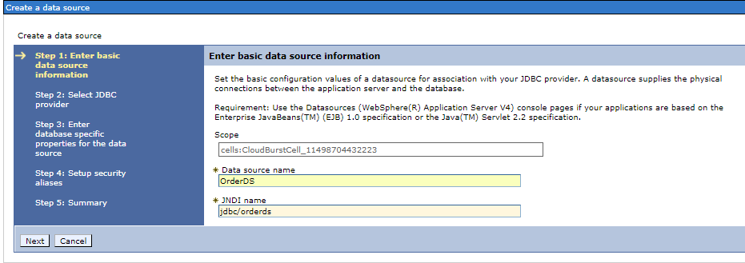

1.  OrderDB - Step 2

-   Select an existing JDBC provider --&gt; **DB2 Using IBM JCC
    Driver (XA)** 

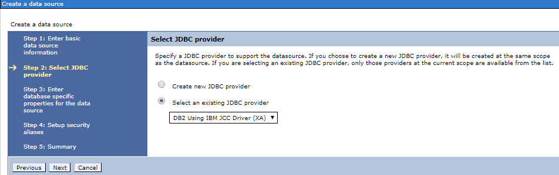

1.  ORDERDB - Step 3

-   Driver Type: **4**

-   Database name: **ORDERDB**

-   Server name: **Your default DB2 host**

-   Port number: **Your default DB2 port** 

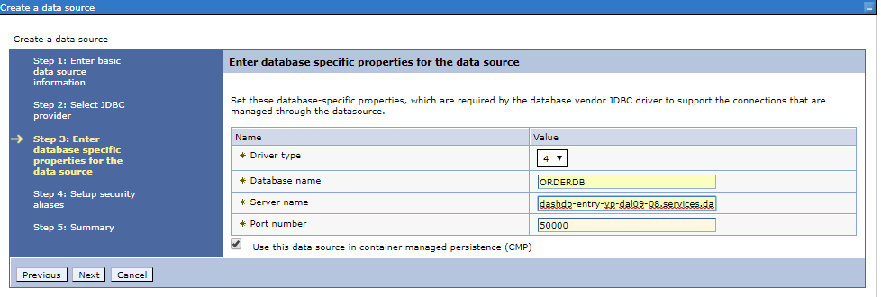

1.  OrderDB - Step 4

-   Authentication alias for XA recovery: **ORDERDB\_USER**

-   Component-managed authentication alias: **ORDERDB\_USER**

-   Mapping-configuration alias: **DefaultPrincipalMapping**

-   Container-managed authentication alias: **ORDERDB\_USER**

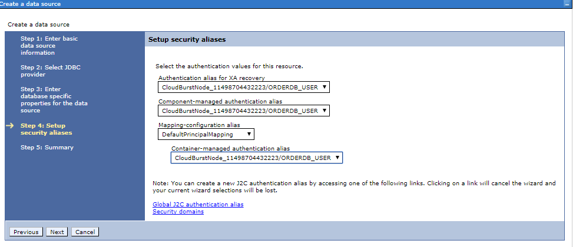

1.  Once this is done, under Preferences, there will be a new resource
    called **OrderDS**. Make sure that the resources got connected
    using **Test Connection** option. You will see a success message if
    the connection is established successfully.

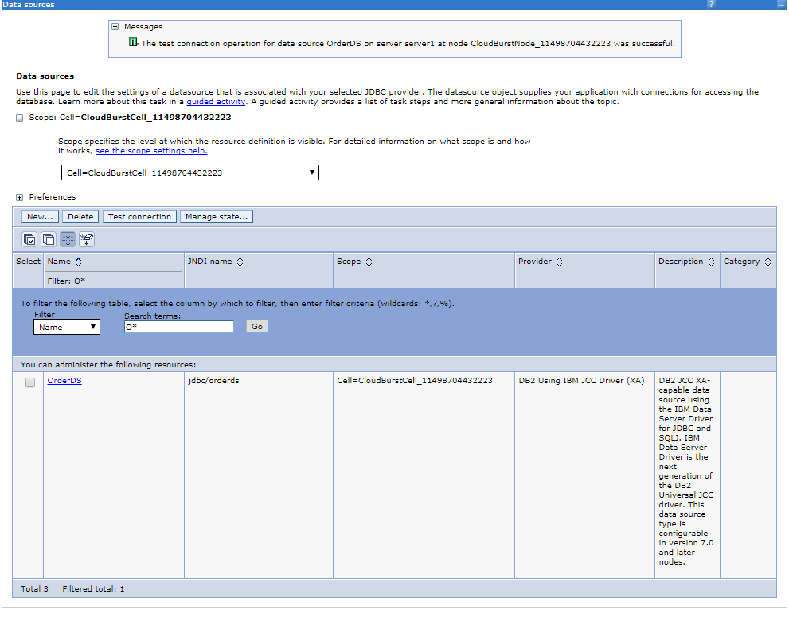

1.  Check the Data source and select Test Connection to ensure you
    created the database correctly. If the connection fails, a few
    things to check are

-   Your database is started as we did in the beginning.

-   Your host and port number are correct.

-   The classpath for the Driver is set properly.

-   Check the WebSphere Variables. You may want to change them to point
    to your local DB2 install

1.  Create the INVENTORYDB data source using the same process as before.
    Click **New**.

<!-- -->

1.  InventoryDB - Step 1

    -   Data source name: **INDS**

    -   JNDI name: **jdbc/inds**

2.  InventoryDB - Step 2

    -   Select an existing JDBC provider --&gt; **DB2 Using IBM JCC
        Driver (XA)**

3.  InventoryDB - Step 3

    -   Driver Type: **4**

    -   Database name: **INDB**

    -   Server name: **Your default DB2 host**

    -   Port number: **Your default DB2 port**

4.  InventoryDB - Step 4

    -   Authentication alias for XA recovery: **INDB\_USER**

    -   Component-managed authentication alias: **INDB\_USER**

    -   Mapping-configuration alias: **DefaultPrincipalMapping**

    -   Container-managed authentication alias: **INDB\_USER**

<!-- -->

1.  Remember to save and test the connection again.

##### Configure JPA

1.  Go to the **Application servers &gt; server1 &gt; Default Java
    Persistence API settings**

2.  Select 2.0 as the JPA Specification

3.  Select *com.ibm.websphere.persistence.PersistenceProviderImpl* as
    the Default Persistence Provider.

4.  Click Apply and Save.

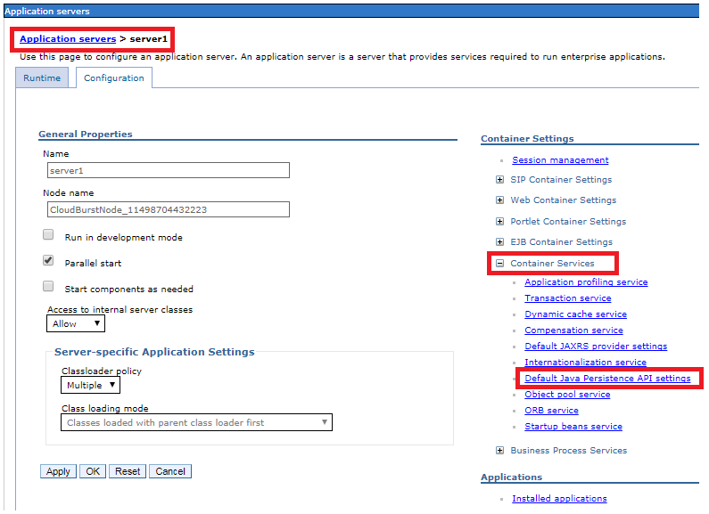

##### Configure JAX-RS

1.  Go to the **Application servers &gt; server1 &gt; Default JAXRS
    provider settings**

2.  Select 1.1 as the JAX-RS provider

3.  Click Apply and Save.

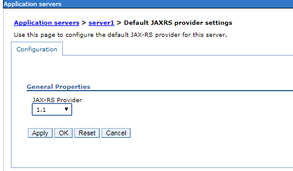

###  Installing the Application in WAS9

1.  Build the EAR using Maven in CustomerOrderServicesProject.

    -   Install Maven and run mvn -v to test your version

    -   cd CustomerOrderServicesProject

    -   mvn clean package

    -   You will have an EAR built in
        the CustomerOrderServicesApp/target subdirectory, named CustomerOrderServicesApp-X.Y.Z-SNAPSHOT.ear.

2.  Install the EAR to <http://localhost:9060/ibm/console>

    -   Login to the Administrative Console.

    -   Select **Applications &gt; Application Types &gt; WebSphere
        enterprise applications**

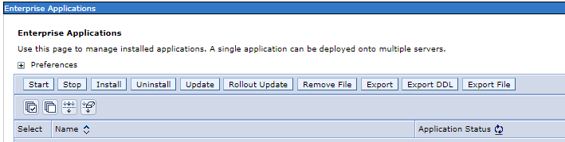

-   Choose **Install &gt; Browse the EAR **

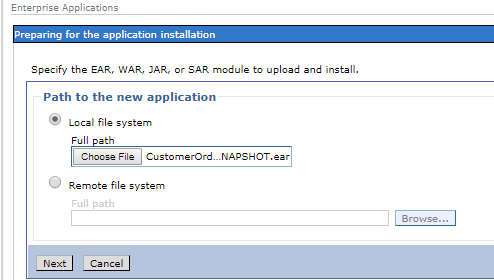

-   **Next &gt; Choose Detailed**

> 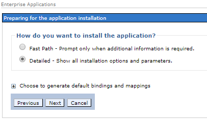
>
> Click on **Step 11**. Verify the **SecureShopper** role is mapped to
> the **SecureShopper** group (or a corresponding group in your
> application server's user registry). 

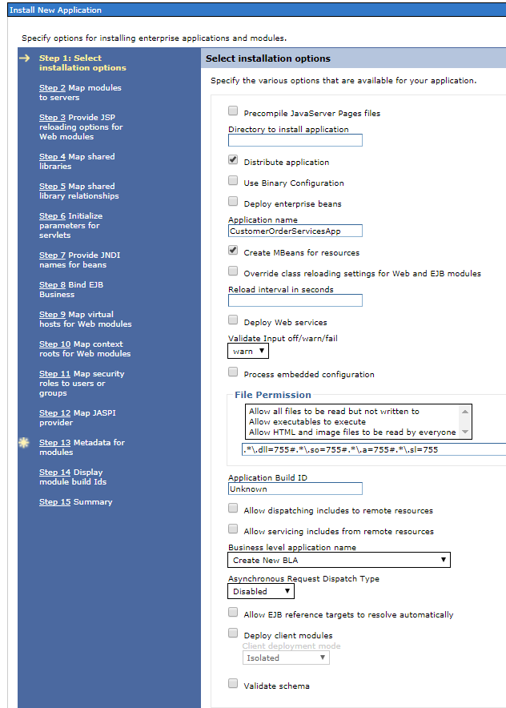

1.  -   Click on **Summary** (Step 15) and click **Finish**.

    -   Once you see Application CustomerOrderServicesApp installed
        successfully, click **Save** and now your application is ready.

1.  Go back to the Enterprise Applications list, select the application,
    and click **Start**.

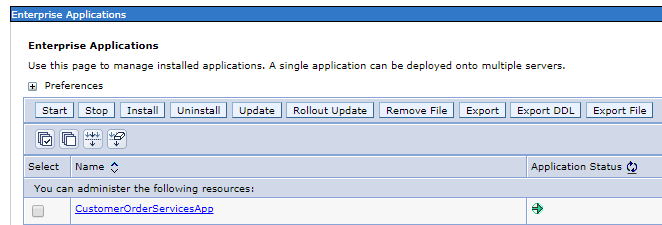
