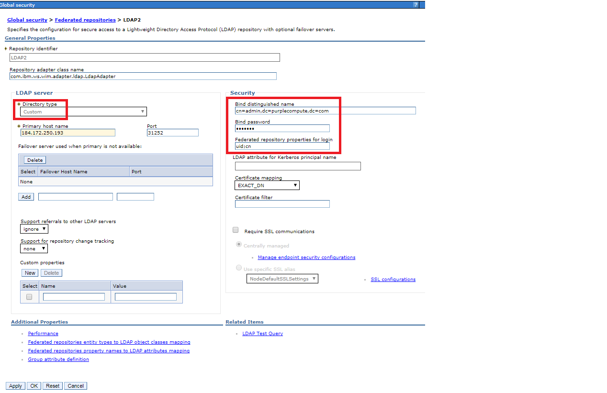
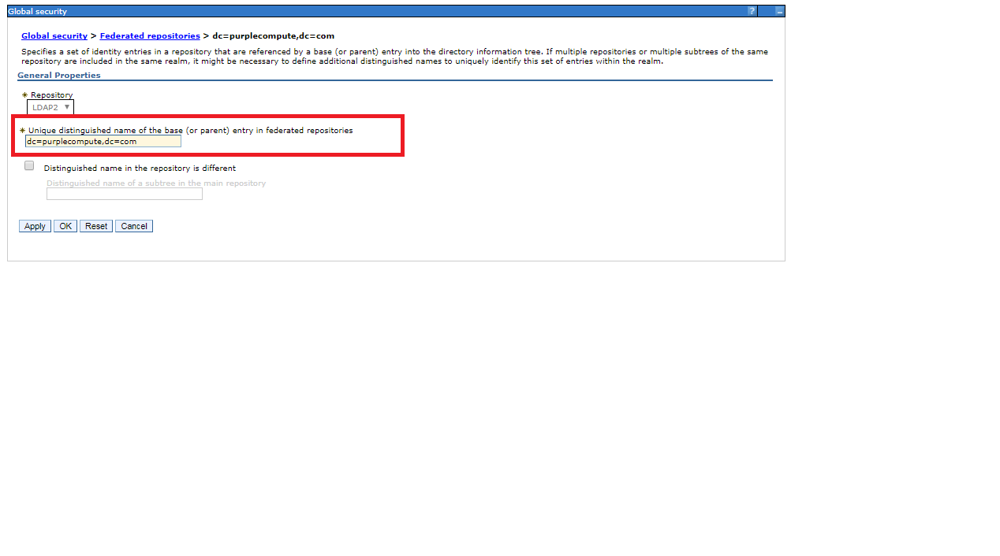

**Open LDAP Container Creation:**

The image is running a stable Debian and be a little less verbose, but
more complete in the configuration.

NOTE: On purpose, there is no secured channel (TLS/SSL).

The Git Hub repository for OpenLDAP is https://github.com/dinkel/docker-openldap

The most simple form would be to start the application like so

sudo docker run -d -e SLAPD\_PASSWORD=Passw0rd -e
SLAPD\_DOMAIN=purplecompute.com dinkel/openldap

The above command will be used to create the image and the same will be
deployed on Kubernetes as a container. Proxy host and proxy port will be
used to access the ldap from the network.

JXplorer is a cross platform LDAP browser and editor. It is a standards
compliant general purpose LDAP client that can be used to search, read
and edit any standard LDAP directory, or any directory service with an
LDAP interface. JX is available as a free open source version under an
OSI Apache 2 style license.

Using JXplorer, an Organization Unit called “India” is created and users
are added to the Organization Unit as uid with object classes Top,
inetOrgPerson, Person and organizationalPerson

A group called “SecureShopper” is created with object class Top and
groupofNames.

Users are added to the group “SecureShopper” as a member with
“uid=kbrown,ou=India,dc=purplecompute,dc=com” and
“uid=rbarcia,ou=India,dc=purplecompute,dc=com”

The root distinguished name and bind distinguished name is
“dc=purplecompute,dc=com”

The default admin user name is “admin and its password is “Passw0rd”.

**Liberty Server Configuration:**

The micro services Liberty Servers are configured with the open ldap for
SSO using LTPA mechanism.

Encrypt the password using the following from the Local Liberty
installed fin directory

securityUtility encode Passw0rd

Use the encoded password in the server.xml file.

In server.xml file add the following features

&lt;feature&gt;appSecurity-2.0&lt;/feature&gt;

&lt;feature&gt;ldapRegistry-3.0&lt;/feature&gt;

and add the following after the feature manager element.

&lt;ldapRegistry baseDN=*"dc=purplecompute,dc=com"*
bindDN=*"cn=admin,dc=purplecompute,dc=com"*
bindPassword=*"{xor}Dz4sLChvLTs="* host=*"184.172.250.193"* id=*"ldap"*
ignoreCase=*"true"* ldapType=*"Custom"* port=*"31252"*
realm=*"184.172.250.193:31252"* searchTimeout=*"8m"*&gt;

&lt;contextPool enabled=*"true"* initialSize=*"1"* maxSize=*"0"*
preferredSize=*"3"* timeout=*"0s"* waitTime=*"3000ms"*/&gt;

&lt;ldapCache&gt;

&lt;attributesCache enabled=*"true"* size=*"4000"* sizeLimit=*"2000"*
timeout=*"1200s"*/&gt;

&lt;searchResultsCache enabled=*"true"* resultsSizeLimit=*"1000"*
size=*"2000"* timeout=*"600s"*/&gt;

&lt;/ldapCache&gt;

&lt;/ldapRegistry&gt;

&lt;!-- Automatically expand WAR files and EAR files --&gt;

&lt;applicationManager autoExpand=*"true"*/&gt;

&lt;webAppSecurity ssoCookieName=*"LtpaToken2"* ssoRequiresSSL=*"true"*
logoutOnHttpSessionExpire=*"true"* httpOnlyCookies=*"true"*
singleSignonEnabled=*"true"* &gt;&lt;/webAppSecurity&gt;

&lt;include location=*"GeneratedSSLInclude.xml"*/&gt;

Add the following into “GeneratedSSLInclude.xml” file. The feature is
added inside the featureManger element.

&lt;feature&gt;appSecurity-2.0&lt;/feature&gt;

The following is added below the featureManager element.

&lt;keyStore id=*"defaultKeyStore"* password=*"{xor}Dz4sLChvLTs="*/&gt;

&lt;ltpa expiration=*"120"* keysFileName=*"ltpa.keys"*
keysPassword=*"{xor}Dz4sLChvLTs="*/&gt;

Include the following highlighted lines into the Dockerfile to copy the
same into Liberty Server Docker Container.

| FROM registry.ng.bluemix.net/ibmliberty:latest                                                                                                             
                                                                                                                                                             
 **COPY target/LocalBackendRestService.war /opt/ibm/wlp/usr/servers/defaultServer/dropins/                                                                   
 COPY target/server.xml /opt/ibm/wlp/usr/servers/defaultServer/                                                                                              
 COPY target/GeneratedSSLInclude.xml /opt/ibm/wlp/usr/servers/defaultServer/                                                                                 
 COPY target/ltpa.keys /opt/ibm/wlp/usr/servers/defaultServer/                                                                                               
 COPY target/key.jks /opt/ibm/wlp/usr/servers/defaultServer/resources/security/                                                                              
 **                                                                                                                                                          
 EXPOSE 9080                                                                                                                                                 
 EXPOSE 9443                                                                                                                                                 
                                                                                                                                                             
 CMD \["/opt/ibm/docker/docker-server", "run", "defaultServer"\]                                                                                             
                                                                                                                                                             
                                                                                                                                                             
                                                                                                                                                             
 Note: Repeat the same procedure for other Liberty based micro services as well.                                                                             
                                                                                                                                                             
 Copy the same files for server.xml, GeneratedSSLIncude.xml, ltpa.keys and key.jks .Only the application war file will be different for each microservices.  
                                                                                                                                                             
**Security Configuration for WAS on Cloud With OpenLDAP:**
                                               
 Login to WAS admin console                                                                                                                                  
                                                                                                                                                             
 Expand Security and Click Global Security link.  
 

Enter unique distinguished name as “dc=purplecompute,dc=com”

