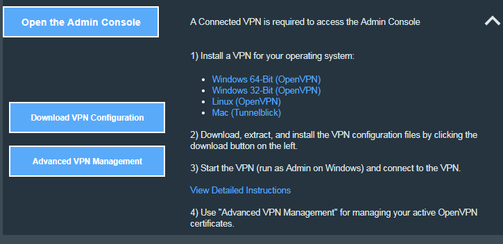
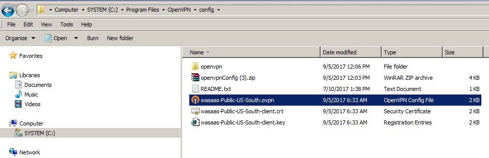

**WAS on Cloud with Filebeat**

Login into IBM Bluemix using your registered email address.

Click on Catalog   and Click Application Services

Click WebSphere Application Server to create a new instance with Default plan.. Accept default instance name and Click Create. Wait for the instance creation completion. It may take 30 minutes depends on the network speed.

Using the Dashboard Click on the WAS Instance and do the following.

Install VPN by downloading the OpenVPN from IBM Bluemix Dashboard while provisioned WAS on Cloud.

Download the VPN configuration zip file.

VPN access is required to access the WAS on Cloud using Putty Client from your system and also to the WAS console on the browsers for further configurations.

Extract the configuration zip file into   C:\Program Files\OpenVPN\config directory  for Windows System.

Note: 3 files are copied as shown below.

Go to the  directory C:\Program Files\OpenVPN\bin

Run the VPN openvpn-gui.exe file using Run as Administrator option from the context menu

Download Linux 64 bit from the below URL

[https://www.elastic.co/downloads/beats/filebeat](https://www.elastic.co/downloads/beats/filebeat)

You can find the Host IP Address and Linux version, OS Admin Username and Admin Password from the WAS instance.

Use the above information to connect using the tools to perform the following:

Copy the filebeat-5.6.3-linux-x86\_64.tar.gz  file into /tmp  using ftp or scp tool.

Open putty session for WAS On cloud and make sure openVPN is running.

Go to /opt directory and create a folder filebeat using  mkdir filebeat

Move filebeat-5.6.3-linux-x86\_64.tar.gz   file from /tmp into /opt/filebeat  directory by executing the following:

Go to the /tmp  using

cd /tmp  and

mv filebeat-5.6.3-linux-x86\_64.tar.gz   /opt/filebeat

change directory using

cd /opt/filebeat

gunzip filebeat-5.6.3-linux-x86\_64.tar.gz

The gunzip command extract the tar file filebeat-5.6.3-linux-x86\_64.tar. Using the tar command to eztract the content.

tar –xvf filebeat-5.6.3-linux-x86\_64.tar

Change the directory using

cd filebeat-5.6.3-linux-x86\_64

Make copy of the original filebeat.yml before modify the file using

cp filebeat.yml filebeat-original.yml

Using vi filebeat.yml  to edit the content and include the highlighted in &quot;red&quot; in it.

filebeat.prospectors:

- input\_type: log

  paths:

     **- / wlp/usr/servers/defaultServer/logs/\*.log**

**-  input\_type : log**

     paths:

       - &#39;/var/lib/docker/containers/\*/\*.log&#39;

Go to the section by scrolling download to modify the following under uncommented the username and password and modify localhost:9200 to IP Address of Kubernetes ELK Pod IP address and associated port for the elasticsearch.

output.elasticsearch:

   #Array of hosts to connect to.

**   hosts: [&quot;173.193.101.11:32156&quot;]**

  # Optional protocol and basic auth credentials.

  #protocol: &quot;https&quot;

  **username: &quot;elastic&quot;**

**  password: &quot;changeme&quot;**

If you modified for elasticsearch you can skip the following. Do either elasticsearch  or logstash modifications. Note: Don&#39;t do both changes in the filebeat.yml file. In this I have modified the elasticsearch.  If you modify the below then enter public  IP address of ELK and port for logstash

#output.logstash:

# The Logstash hosts

  #hosts: [&quot;localhost:5044&quot;]

Save the file using the command after escape from the editor &quot; :wq!&quot;  to persist the changes.

Execute the filebeat using the command below.

./filebeat –e –c filebeat.yml –d &quot;publish&quot;

Note: Firewall should be disabled for the Linux system in order to execute the above command.

Go to Kibana dashboard by opening a browser using IP address and port  and view the logs in it either filebeat-\* indices or logstash -\* indices with @timestamp
